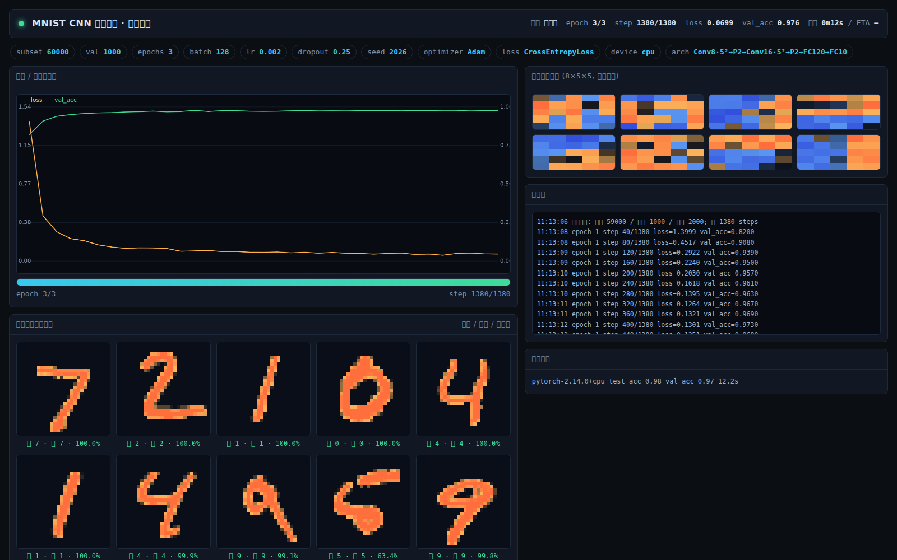
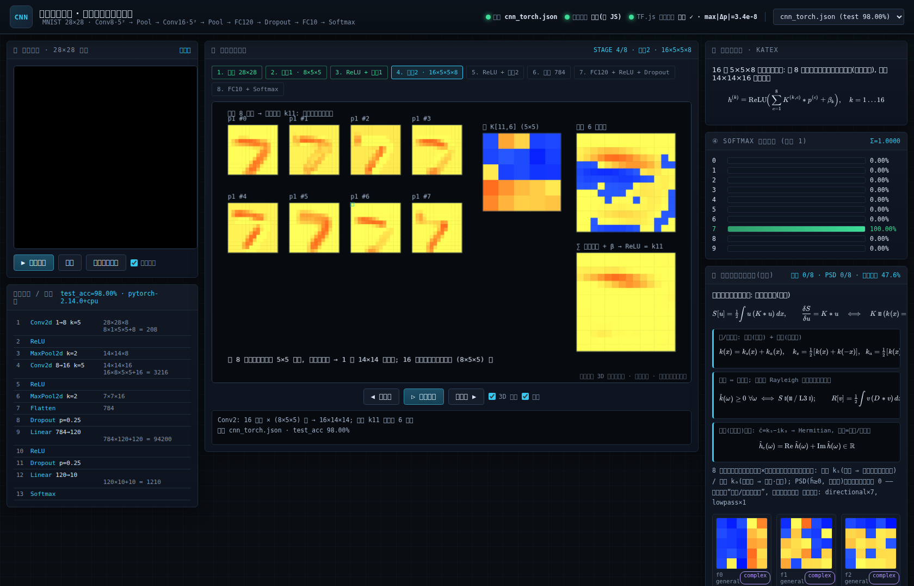
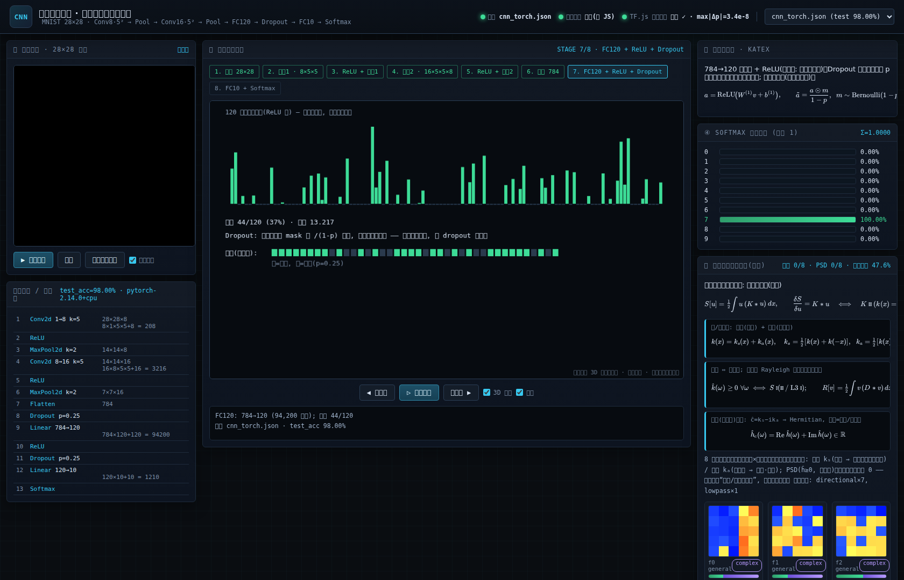

# 算子生成与分析工作台 · Operator Lagrangian Lab

> GitHub: <https://github.com/jiokis/aut_conv>

把 DeepSeek 分享对话《卷积算子的等变性与拉氏函数》(分享链接内 14 轮推导:
拉格朗日可导出性 ⇔ 自伴/偶核 → 核方法的一般拉氏量 → 卷积核设计空间
L1 平移等变 / L2 自伴 / L3 正定 / L4 格林核 / L5 群等变 → 一般核不能由多个
拉氏量组合 → 谱三分 势能/陀螺/耗散 → 十字核逐层分析)做成一个**可交互的
算子(卷积核)生成与分析 Web 程序**: 画/生成核 → 全自动跑完整分析管线。

> **仓库说明**: 本仓库不含 MNIST 原始数据与 numpy 缓存(`data/*.gz`、`data/*.npy`, 已在 .gitignore 排除),
> 首次运行 CNN 页会自动下载(~15MB)并缓存; 含已训练的 98% 权重 `data/cnn_mnist.json` 与实验结果 JSON。
> 卷积核实验室为纯标准库零依赖; CNN 模块需 numpy(用 `CNN_PYTHONPATH=<numpy目录>` 启动)。

## 运行

```bash
cd /home/dunaandone/dswork1/operator-lab
bash run.sh            # 零依赖, 需要 Python 3.10+
# 打开 http://127.0.0.1:8017
```

后端是**纯 Python 标准库** HTTP 服务(无 numpy/fastapi, 自带基 2 FFT),
前端为原生 HTML/CSS/JS, 无任何外部 CDN/构建步骤。

## 启动服务(推荐)

```bash
bash start.sh           # 启动主服务(实验室 + CNN 分析 + 演示台), 端口 8017
bash start.sh board     # 额外启动训练进度看板(端口 8020, 输出 data/cnn_board.json)
bash start.sh status    # 查看运行状态与监听端口
bash start.sh stop      # 停止
bash start.sh restart   # 重启
```

服务通过 `setsid + nohup` **完全脱离终端**(日志写入 `logs/`), 并监听 `0.0.0.0`,
因此 Windows 浏览器可用两种地址访问(WSL 环境):

| 页面 | localhost | WSL IP 备选 |
|---|---|---|
| 实验室(卷积核/设计空间) | http://127.0.0.1:8017/ | http://<WSL_IP>:8017/ |
| CNN 分析(逐层/机制/规则) | http://127.0.0.1:8017/cnn.html | http://<WSL_IP>:8017/cnn.html |
| **CNN 演示台(手写识别)** | http://127.0.0.1:8017/demo/ | http://<WSL_IP>:8017/demo/ |
| 训练进度看板 | http://127.0.0.1:8020/ | http://<WSL_IP>:8020/ |

`WSL_IP` 用 `hostname -I | awk '{print $1}'` 获取(本机当前为 `192.168.31.74`)。
若 localhost 打不开而 WSL IP 能开, 说明 Windows 的 WSL localhost 转发未生效, 直接用 WSL IP 即可;
两者都不通时检查 Windows 防火墙是否放行 WSL 网段。

> 小提示: 训练看板默认输出到 `data/cnn_board.json`, 不会覆盖演示页使用的 `data/cnn_torch.json`。
> 无界面训练(脚本/CI)可加 `--no-serve`。

## 功能

### 算子(卷积核)输入与生成 — 左栏
- **手绘**: 1–15(奇数)网格; 点击单元格填笔值(0/±1/±2), 双击进入数值输入;
  清空 / 取偶部 kₛ / 取奇部 kₐ / 从 JSON 或 `a,b;c,d` 文本导入 / 复制导出核。
- **预置**: 十字核(对话主角)、Δ₄、Δ₈、二项式高斯、δ、窗口核、锐化 5δ−Δ₄、
  Sobel X/Y、一阶差分、Prewitt —— 覆盖 L1..L3 各层示例。
- **参数化族**: 高斯 exp(−r²/2σ²)、指数/Yukawa、支撑窗、热核与有理符号族
  (后两者经大格点 IDFT 采样 → 窗口裁切, 标注截断语义)。
- **随机生成**: 一般 / 偶 / 奇(陀螺) / 正定(自动加 δ 抬升使符号非负)四类。

### 分析报告 — 右栏(约 0.5 s/次, 自动随编辑刷新)
1. **设计空间定位**: L1..L5 层级芯片点亮 + 一句话结论(可导出拉氏量? 凸能量?)
2. **指标条**: DC 增益、L² 范数、谱范围、偶/奇占比、正定性、滤波器型、各向异性
3. **频率响应(符号)**: Re Ĥ 热图(标极值点)、|Ĥ| 幅值、一维切片折线(ω₁ 轴与对角)
4. **谱分解**: 自伴核按符号拆 H⁺(势能) 与 −H⁻(=耗散 D 的符号), 给出谱和
5. **对称性与奇偶分解**: K / kₛ(自伴) / kₐ(陀螺) 三图 + 180°/D4/镜像判定
6. **拉格朗日泛函与能量语义**: S[u]=½∫u(K*u); 梯度流 dE/dt=−⟨u,Ku⟩ 语义表
7. **滤波行为探针**: 常数 / 斜坡 / 低频正弦 / 棋盘 / 脉冲 五模式逐卷积分看
8. **属性总表 + 自动结论**, 底部**理论速查**折叠卡(对话要点)

### CNN 手写数字识别 · 算子架构系统性分析(`cnn.html`, 与实验室页顶部互链)
真实训练 LeNet 式 CNN(28×28→Conv8·5²-ReLU-Pool₂→Conv16·5²-ReLU-Pool₂→FC120→10,
Adam, MNIST 30k×3 轮, **测试准确率 98.0%**), 用同一套算子/拉氏量架构**逐层分析滤波器**:
- **手写画板实时预测**: 28×28 光栅化 + 质心居中 → 软最大概率条(可在线重训 5k–60k×1–6 轮, 后台线程+进度轮询)。
- **Conv1**(8 个单通道 2D 算子)与 **Conv2**(16 输出 × 8 分量 = 128 个 2D 算子)逐算子分析:
  偶/奇分解占比、正定性、频带类型、方向直方图、与经典算子模板匹配(拉普拉斯/Sobel/Prewitt/高斯…)、拉普拉斯拟合。
- **系统解读面板**: 按对话框架自动生成五段结论(实测数据填入)。
- **复场(虚数)视角切换**: 复化 ĉ=kₛ−ikₐ ⇒ 任意实核 Hermitian(实谱 Re ĥ+Im ĥ), 奇部=动能/电流;
  实测动能占比=奇部占比、Hermitian 正定仍 0/136(详见 ANALYSIS_RULES.md)。
- **⑤ 端到端分类机制定量解剖**(backend/mech.py): 各级线性可分度(像素80.8%→Conv栈98.0%→FC1 98.8%)、
  通道×数字证据矩阵与判别力 F、末层决策方向几何/混淆结构、ReLU 稀疏门控(FC1 激活率~35%)。
- **⑥ 模块作用机理 · 系统消融**(backend/mech_modules.py): 12 个训练期变体(去卷积/去池化/去ReLU/
  去隐藏层/偶核约束/随机核冻结/全线性…) + 13 个推理期干预(逐层关 ReLU、事后对称投影、核打乱对照、
  填充式遮挡、逐通道置零、显著性), 量化“每个模块到底贡献多少”。
- **④ 定量结论 & 设计规则面板**: 受控实验(`backend/exp_rules.py` → `data/exp_rules.json`)
  实测“偶核(自伴=拉氏量可导出)约束 +0.06pp / 奇核 −0.07pp、PSD 恒 0、奇偶预算分层规律”;
  完整报告见 `ANALYSIS_RULES.md`。


## 训练脚本 + 实时 Web 进度看板(`backend/train_web.py`)

完整的手写数字 CNN 训练脚本(PyTorch), **训练的同时启动 Web 看板**实时展示进度。

```bash
pip install -r requirements.txt          # torch + numpy(本机已具备, 可跳过)
python3 backend/train_web.py             # 默认 30000 样本 × 3 轮, 端口 8020
# 浏览器打开 http://127.0.0.1:8020
```

常用参数: `--subset 60000 --epochs 3 --batch 128 --lr 2e-3 --dropout 0.25 --port 8020 --out data/cnn_torch.json`

看板实时内容: 损失/验证准确率曲线、epoch/step 进度条与 ETA、**8 张固定测试样本的实时预测**、
**第一层 8 个 5×5 卷积核热图(随训练演化)**、控制台日志、网络结构与参数量。
训练结束把权重导出为 `data/*.json`(与演示页、分析页同格式)。

实测(本机 CPU): 60000 样本 × 3 轮仅 **12 秒**, 验证 97.0% / 测试 **98.0%**。

## 演示台(`frontend/demo/index.html`)

**http://127.0.0.1:8017/demo/** — 工业软件风格的卷积神经网络全流程演示:

- **手写面板**(28×28 灰度) + 「确认演示」; 也可一键载入 MNIST 测试样本
- **逐层前向演示**(8 步): 输入 → 卷积1(卷积核滑窗、逐项相乘、求和 Σ、特征图实时填充)
  → ReLU+池化1 → 卷积2(多通道分别卷积再求和) → ReLU+池化2 → 展平 784 → FC120+ReLU+Dropout → FC10+Softmax
- **3D 特征图堆栈**(Canvas 仿射投影, 可拖动旋转/滚轮缩放) + 2D 热图模式
- **KaTeX 公式**(已本地化到 `frontend/demo/vendor/katex/`, 离线可用)逐步展示每层数学式
- **概率分布**: 10 类概率条, 显式和 Σp=1
- **⑤ 拉格朗日算子分析面板**(融合): 8 个第一层卷积核的偶/奇分解、谱范围、PSD 判定与经典算子匹配,
  并给出 S[u]=½∫u(K*u)、k=kₛ+kₐ、ĥ≥0⇔凸、Rayleigh、复化 Hermitian 等公式
- **可选 TensorFlow.js 交叉验证**: 同一权重在 TF.js 上重跑并对比概率(实测 max|Δp|≈1e-8)





### 三段一致性验证
纯 JS 前向引擎(演示页) / Python 后端 / TensorFlow.js 使用同一份权重:
4 个测试样本预测类别 4/4 一致, 最大概率偏差 **1.4e-5**(JS↔Python) 与 **1.2e-8**(JS↔TF.js)。

## 网络结构(CNN)

```
输入 28×28×1
 1 Conv2d  1→8   k=5 s=1 p=2    → 28×28×8    参数 208
 2 ReLU
 3 MaxPool2d k=2 s=2            → 14×14×8
 4 Conv2d  8→16  k=5 s=1 p=2    → 14×14×16   参数 3,216
 5 ReLU
 6 MaxPool2d k=2 s=2            → 7×7×16
 7 Flatten                      → 784
 8 Dropout  p=0.25              (训练时; 推理关闭)
 9 Linear  784→120                            参数 94,200
10 ReLU
11 Dropout  p=0.25
12 Linear  120→10                             参数 1,210
13 Softmax                      → 10 类概率(Σ=1)
```
共 2 个卷积层(5×5 核)、2 个 2×2 最大池化、2 个全连接层, 可训练参数约 9.9 万。

## 后端 API(pure Python)

| 端点 | 说明 |
|---|---|
| `POST /api/analyze` | `{kernel: N×N}` → 完整分析报告(对称/自伴/正定/谱/分解/探针/结论) |
| `POST /api/parametric` | `{family, m, params}` → 采样核 + 家族说明 |
| `POST /api/random` | `{m, kind, intensity?, seed}` → 按类别随机核 |
| `GET /api/cnn/model` | CNN 模型状态(已训练/测试准确率/超参) |
| `POST /api/cnn/predict` | `{pixels: 28×28}` → 10 类概率 + 预测 |
| `POST /api/cnn/layers` | 对 Conv1/Conv2 全部滤波器做算子分析(需已训练) |
| `POST /api/cnn/train` / `GET /api/cnn/train_status` | 后台训练 + 进度轮询 |
| `GET /api/cnn/rules` | 定量实验结论(`data/exp_rules.json`, 由 `backend/exp_rules.py` 生成) |
| `GET /api/cnn/mech` | 分类机制解剖(`data/mech.json`, 由 `backend/mech.py` 生成) |
| `GET /api/cnn/modules` | 模块消融/机理(`data/modules.json`, 由 `backend/mech_modules.py` 生成) |
| `GET /api/cnn/arch` | 网络结构定义(训练脚本/演示页共用) |
| `GET /api/cnn/weights?model=x.json` | 模型权重(供演示页 JS 引擎载入) |
| `GET /api/cnn/sample?i=N&model=x.json` | MNIST 测试样本 + 真值 + 后端预测 |
| `GET /demo/index.html` | CNN 演示台页面 |
| `GET /api/health` | 服务自检(含 `cnn: 是否具备 numpy`) |
| 静态 `/`、`/cnn.html` | 两个前端页面 |

> CNN 模块依赖 numpy。无 numpy 时卷积核实验室完整可用; 启用 CNN 方式:
> `CNN_PYTHONPATH=<numpy所在目录> python3 backend/main.py`(首次会下载并缓存 MNIST ~15MB)。
> 已训练权重存于 `data/cnn_mnist.json`(可删除后重新训练)。

## 数学约定(与对话一致)

- 核为正方形、奇数边长, 中心格为坐标原点。卷积 `(K*u)(x)=Σ K[a]u[x−a]`。
- **自伴 ⇔ 偶核** k(x)=k(−x)(180° 对称) ⇔ 可导出二次拉氏量 S[u]=½∫u(K*u)。
- 正定性用符号采样判定(128² 网格, 容差 1e-4·max|H|); 反自伴(奇核)无实正定性,
  语义为**陀螺项**(⟨u,Au⟩=0, 能量守恒)。
- 能量判据: 梯度流 ∂u/∂t=−K u, E=½‖u‖² ⇒ dE/dt=−⟨u,Ku⟩(探针面板逐模式给出,
  负数 = 负能量模式 / 非凸证据)。
- 最终分解 A=A_pot+A_gyro−D: 正谱自伴=势能(拉氏量), 奇部=陀螺,
  D=−A_neg 正定偶核经 **Rayleigh 函数 R[v]=½∫v(D*v)** 进入变分框架。
- 按对话偏好全程**实核框架**(不引入复数化)。

## 文件

```
operator-lab/
├── run.sh                  # 启动脚本
├── backend/
│   ├── kernelmath.py       # 数学引擎: FFT/谱分析/分解/生成器(纯 Python)
│   ├── cnn.py              # numpy CNN: MNIST/训练/推理/层算子分析
│   ├── main.py             # HTTP 服务(标准库, 静态 + JSON API)
│   ├── exp_rules.py        # 定量实验(偶/奇约束 vs 自由): → data/exp_rules.json
│   ├── mech.py             # 端到端分类机制量化: → data/mech.json
│   ├── mech_modules.py     # 模块作用机理消融: → data/modules.json
│   └── selftest.py         # 数值自检: python3 backend/selftest.py
├── ANALYSIS_RULES.md    # 定量结论与一般设计规则(完整报告)
└── frontend/
    ├── index.html          # 页面骨架
    ├── styles.css          # 深色科学风 UI
    └── app.js              # 编辑器 / 生成器 / 报告渲染(原生 JS)
```

## 自检

```bash
python3 backend/selftest.py   # 校验符号解析 / FFT 卷积 / 分解 / 生成族
```

## 许可

本项目采用 [MIT License](LICENSE)。
